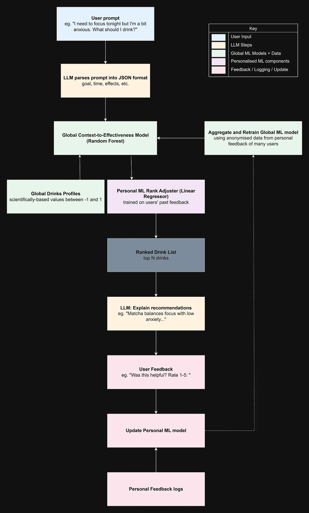

# llm-ml-caffeine-assistant

LLM + ML hybrid architecture for personalised caffeine recommendation with user-in-the-loop learning.

  

Below is the proposed system architecture:

  



  

This project aims to solve the problem of LLM unreliability by replacing the reasoning with machine learning algorithms while retaining the natural language processing element that LLMs excel at. This is done through the context of caffeine drink recommendation.

## Setup & Installation

1. Clone this repository:
```bash
git clone https://github.com/georgp23/llm-ml-caffeine-assistant.git
cd llm-ml-caffeine-assistant
```

2. Create and activate a virtual environment (recommended):
```bash
python3 -m venv venv
source venv/bin/activate  # On Windows use: venv\Scripts\activate
```
3. Install dependencies:
```bash
pip install -r requirements.txt
```

4. Setup environment variables:

Create a .env file in the project root directory with the following content:
```env
OPENAI_API_KEY=your_api_key_here
```

## Progress

User Prompt: ✅

LLM Parses Prompt into JSON format: ✅

Global Drinks Profile: ✅

Global Context-to-Effectiveness Model (RF): ✅

Personal ML Rank Adjuster: ✅

Ranked Drink List: ✅

LLM Explain Recommendations: ✅

User Feedback: ✅

Update Personal ML model: ✅

Personal Feedback Logs: ✅

Aggregate and Retrain Global ML Model: ✅

Robustness and Testing: 🚧 In progress

## Contributing

Contributions are welcome! Please feel free to open issues or submit PRs to improve the project.

## License

MIT License 