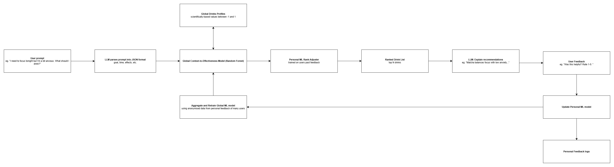

# llm-ml-caffeine-assistant

LLM + ML hybrid architecture for personalised caffeine recommendation with user-in-the-loop learning.

  

Below is the proposed system architecture:

  

  

This project aims to solved the problem of LLM unreliability by replacing the reasoning with machine learning algorithms while retaining the natural language processing element that LLMs excel at. This is done through the context of caffeine drink recommendation.

## Progress

User Prompt: ✅

LLM Parses Prompt into JSON format: ✅

Global Drinks Profile: ✅

Global Context-to-Effectiveness Model (RF): ✅

Personal ML Rank Adjuster: ✅

Ranked Drink List: ✅

LLM Explain Recommendations: ✅

User Feedback: ✅

Update Personal ML model: ✅

Personal Feedback Logs: ✅

Aggregate and Retrain Global ML Model: ✅

